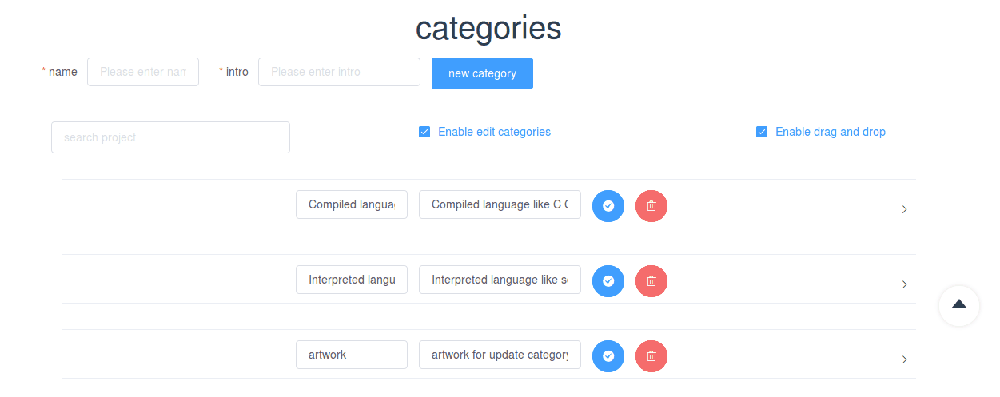

# aboutoa

## demo

1. first,you should enable drag and drop !
2. then, you can drag and drop a category, and their order would change.
3. and more, you can drag and drop a project from one category to another category,
all affected project would change order!
4. you can edit and delete project by click the button. 





for current version, we just use findAll categories and their projects.<br>
so the categories.vue is not satisfy findAndCountAll which should be done on another branch. <br>
just because the other page is unable to get and handle 

## about vue.draggable

if we move an element from one span to another span.
the draggable would emit an added event and then emit removed event.<br>
if we change the element in added event binding function.
the removed event will get the changed element which is not what we want ! take care of it!<br>
if we just move an element in one span , all we get is moved event.<br>
by the way,the <transition-group> must have a class or min-height so we can move an element into it.<br>
Note that all the method starting by "on" will be ignored as draggable component expose the same API via events.

  for more infomation take a look at [vue.draggable](https://github.com/SortableJS/Vue.Draggable)


> A Vue.js project aboutOA

## Build Setup

``` bash
# install dependencies
npm install

# cnpm install
# maybe you need to install vuedraggable !
# npm install vuedraggable
# serve with hot reload at localhost:8080
npm run dev

# build for production with minification
npm run build

# build for production and view the bundle analyzer report
npm run build --report
```

For a detailed explanation on how things work, check out the [guide](http://vuejs-templates.github.io/webpack/) and [docs for vue-loader](http://vuejs.github.io/vue-loader).
